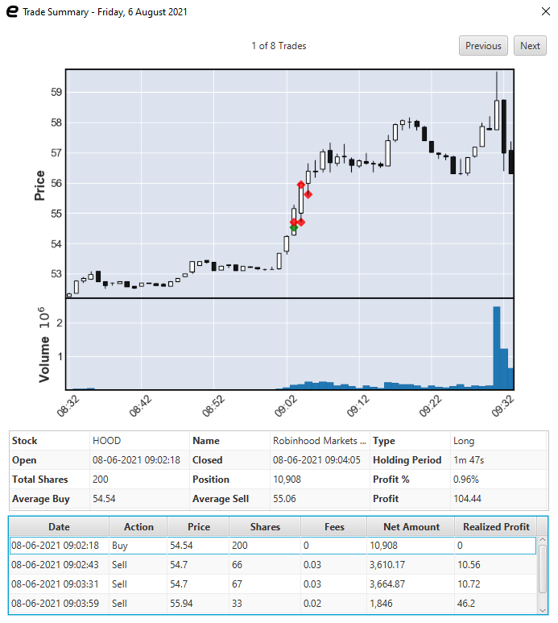

# eJournal
Your FREE electronic Trading Journal

Visualize your trading performance with One Click!

# Features
- One Click get all data from email
- Auto Plot your trades

- All statistics like any other journal platform
- Charts and Analytics
- Import Invoice and Ledgers
- Earl Style Planner - Get the optimal shares from Entry/Stop input
- And many more!

# Supported Brokers
- COL Financial
- AAA Equities
- 2TradeAsia
- eToro
- TradeZero

# Development Getting Started
## Pre-requisite
- Scene Builder version 8 - [download link](https://gluonhq.com/products/scene-builder/)
- Java 11
- Gradle 7
